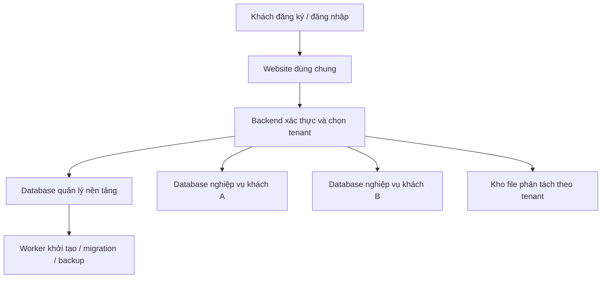

# Kế hoạch chuyển Garage thành SaaS nhiều khách hàng

Ngày lập: 09/10/2026. Trạng thái: kế hoạch triển khai; chưa chuyển database hoặc mở đăng ký công khai.

Cập nhật: phần nền tảng đã được triển khai và kiểm thử; xem `saas-implementation-2026-10-09.md` để đối chiếu kết quả và phần còn thiếu. Phương án hosting được chốt là chuẩn bị Windows; chưa có tên miền/máy chủ/dịch vụ email.

## 1. Mục tiêu và phạm vi bản đầu

Khách tự đăng ký dùng thử và có dữ liệu nghiệp vụ riêng. Dùng chung frontend/backend; mỗi khách hàng (tenant) có một database nghiệp vụ riêng. Cửa hàng đang hoạt động trở thành tenant đầu tiên, giữ nguyên dữ liệu.

Tenant đại diện cho doanh nghiệp thuê phần mềm. Chi nhánh là đơn vị nằm trong doanh nghiệp, không đồng nhất với tenant. Bản đầu hỗ trợ một cửa hàng cho mỗi tenant; giữ mô hình nhận diện để bổ sung nhiều chi nhánh sau. Tách dữ liệu theo database chưa tự cung cấp cách ly tài nguyên hoặc bảo đảm an toàn: vẫn cần xác thực, phân quyền và kiểm soát mọi nguồn dữ liệu.

Giữ Express, React và Firebird trong giai đoạn đầu. Database quản lý nền tảng tách khỏi các database nghiệp vụ; có thể dùng Firebird riêng trong bản đầu để giảm thay đổi công nghệ. Không yêu cầu chuyển toàn bộ nghiệp vụ sang hệ quản trị mới. Khả năng nâng cấp Firebird, hệ điều hành hosting và driver được đánh giá riêng trước triển khai production.

Quy ước sản phẩm đề xuất: dùng thử 14 ngày, bắt đầu khi khởi tạo thành công; hết hạn chuyển sang chế độ chỉ đọc trong thời gian giữ dữ liệu được công bố. Không tự xóa dữ liệu ngay khi hết thử. Thời hạn giữ dữ liệu, hạn mức tài khoản/dung lượng và giá gói cần được chốt trước khi nhận khách thật.

## 2. Kiến trúc dự kiến

Database nền tảng giữ thông tin tenant, định danh đăng nhập, membership, gói sử dụng, trạng thái dùng thử, vị trí database nội bộ và tác vụ vận hành. Database nghiệp vụ giữ dữ liệu nhân viên, phân quyền chức năng, phụ tùng, khách hàng, sửa chữa, kho và tiền của khách đó.

Một định danh đăng nhập có thể thuộc nhiều tenant thông qua membership. Membership liên kết với SUSER trong database nghiệp vụ. Bản đầu tạo một membership chủ cửa hàng khi đăng ký; việc chuyển tenant vẫn phải được server xác minh. Cần thiết kế việc chuyển các tài khoản cũ sang định danh nền tảng, bao gồm tài khoản có tên trùng ở các tenant, trước khi chuyển xác thực production.

Backend chọn database qua tenant đã được xác thực và membership hợp lệ. Không nhận đường dẫn database hoặc thông tin kết nối tùy ý từ client. URL/mã cửa hàng chỉ giúp xác định tenant cần truy cập, không phải bằng chứng quyền truy cập. Token gắn định danh, tenant và phiên bản phiên; người dùng chỉ được truy cập tenant có membership đang hoạt động.

## 3. Các giai đoạn triển khai

### Giai đoạn 0 — Chuẩn bị nền dữ liệu

- Lập danh sách tất cả bảng, stored procedure, trigger, migration, file, cache, tác vụ nền và cấu hình đang dùng chung.
- Phân loại dữ liệu khởi tạo: cấu trúc, danh mục hệ thống, quyền mặc định, mẫu in được phép dùng chung. Loại bỏ mọi chứng từ, ảnh, khách hàng, tồn kho, tài khoản và secret của khách hiện tại.
- Tạo mẫu database sạch có phiên bản schema, có thể tạo tenant mới lặp lại một cách kiểm soát.
- Lập registry migration thay cho việc chạy thủ công các script có đường dẫn database cố định; hỗ trợ chạy trên database được chỉ định và ghi nhận phiên bản.
- Sao lưu cửa hàng hiện tại, thử khôi phục và chuẩn bị môi trường staging riêng.

Nghiệm thu: tạo database sạch từ đầu, không có dữ liệu kinh doanh/tài khoản cũ; migration chạy lại không gây hỏng dữ liệu; bản backup khôi phục được.

### Giai đoạn 1 — Tách kết nối và quyền theo tenant

- Thay kết nối cố định trong `backend/src/db.js` bằng lớp chọn kết nối theo tenant. Pool có giới hạn số lượng/kết nối, thu hồi pool nhàn rỗi và giới hạn tổng tài nguyên.
- Mỗi request/transaction có context tenant bất biến; sử dụng truyền context rõ ràng hoặc AsyncLocalStorage có kiểm tra bắt buộc. Thiếu tenant phải bị từ chối, không ngầm chọn database cửa hàng hiện tại.
- Không đổi biến cấu hình toàn cục theo request: các request đồng thời có thể truy cập nhầm database.
- Tách định danh nền tảng và quyền nghiệp vụ; token và logout/reset mật khẩu gắn đúng định danh/tenant. Chuyển tài khoản cũ có kế hoạch tương thích rõ ràng.
- Khóa cache, idempotency, số chứng từ, nội dung in, ảnh, mẫu in, export và job theo tenant. Worker phải mang tenant rõ ràng, không phụ thuộc request hiện tại.
- Ghép print agent/thiết bị với tenant, xác thực yêu cầu và chống lấy việc in của tenant khác.
- Tạo hai tenant kiểm thử; chuyển cửa hàng hiện tại thành tenant đầu tiên bằng ánh xạ database sẵn có.

Nghiệm thu bắt buộc: hai tenant có thể có ID chứng từ và tên tài khoản giống nhau mà không lẫn dữ liệu; truy cập chéo JSON/PDF/ảnh/export/print job bị từ chối; request đồng thời không đổi tenant; không xác định được tenant thì không truy cập database nghiệp vụ.

### Giai đoạn 2 — Đăng ký và khởi tạo dùng thử

- Form đăng ký: tên cửa hàng, tên chủ, email, số điện thoại, mật khẩu và chấp nhận điều khoản.
- Xác minh email; giới hạn đăng ký/gửi mã theo IP và định danh. Dịch vụ email production được cấu hình riêng, không coi toast là gửi thư thành công.
- Tạo tenant ở trạng thái provisioning và giao việc tạo database cho worker; khách thấy tiến độ, không bị buộc chờ một request HTTP dài.
- Khởi tạo database sạch, chạy migration, tạo SUSER chủ cửa hàng/quyền, cấu hình thương hiệu và membership.
- Chỉ kích hoạt dùng thử khi toàn bộ khởi tạo thành công. Retry cùng yêu cầu không tạo thêm tenant/database hoặc tài khoản.
- Job có trạng thái, khóa chống chạy trùng, số lần retry và thông báo lỗi; tài nguyên tạo dở được xử lý có kiểm soát.

Nghiệm thu: khách tự đăng ký, xác minh, vào cửa hàng trống và tạo được giao dịch; thử lỗi giữa chừng rồi retry không sinh dữ liệu trùng; tenant chưa sẵn sàng không được truy cập nghiệp vụ.

### Giai đoạn 3 — Quản lý thuê bao và trang quản trị nền tảng

- Mô hình dữ liệu tối thiểu: tenants, identities, memberships, plans, subscriptions, provisioning_jobs, migration_runs, backup_runs, audit_events.
- Trạng thái tenant: provisioning, active, suspended, failed, archived; trạng thái thuê bao tách riêng: trial, paid, expired. Tính thời hạn bằng thời gian server, lưu UTC và hiển thị theo múi giờ phù hợp.
- Banner thời hạn dùng thử và màn hình gia hạn; kiểm tra quyền ghi/hạn mức ở backend cho cả UI và API.
- Chế độ hết hạn cho phép đọc/xuất dữ liệu theo chính sách, chặn ghi và các tác vụ nền có thay đổi dữ liệu. Không chỉ khóa menu frontend.
- Trang quản trị nền tảng cho chủ sản phẩm: xem khách, kích hoạt/gia hạn thủ công, khóa/mở, theo dõi khởi tạo/backup/migration. Quyền này tách khỏi Admin cửa hàng.
- Mọi can thiệp hỗ trợ vào dữ liệu khách phải được giới hạn, có lý do và nhật ký. Không mặc định cho quản trị nền tảng đọc mọi dữ liệu kinh doanh.
- Bản đầu cho phép gia hạn thủ công; thanh toán online triển khai sau, có webhook xác thực và chống xử lý trùng.

Nghiệm thu: hết hạn chặn ghi cả khi gọi API trực tiếp; gia hạn mở lại mà giữ nguyên dữ liệu; Admin cửa hàng không vào được trang quản trị nền tảng.

### Giai đoạn 4 — Hosting và vận hành

- Hosting tập trung, tên miền và HTTPS; Firebird chỉ cho backend/worker truy cập qua mạng nội bộ. Tách thông tin DB khỏi tài khoản người dùng ứng dụng và dùng quyền DB phù hợp.
- Cấu hình origin/proxy/API thống nhất; quản lý secret tập trung và cơ chế thu hồi phiên giữa các instance trước khi chạy nhiều backend.
- Backup định kỳ từng tenant và database nền tảng; mã hóa/quyền truy cập, chính sách lưu giữ, cảnh báo khi thất bại và restore drill định kỳ.
- Migration theo từng tenant: backup trước, thử một nhóm nhỏ, giới hạn đồng thời, ghi phiên bản và lỗi; tenant lỗi được cô lập, không tuyên bố cập nhật thành công cho toàn hệ thống. Chuẩn bị khôi phục nếu thay đổi schema không đảo ngược được.
- Log có tenant và request ID, loại mật khẩu/token/dữ liệu nhạy cảm; theo dõi tài nguyên và hạn mức để một khách không làm nghẽn tất cả khách khác.
- Đo tải với dữ liệu và số người dùng mục tiêu, rồi chốt cấu hình máy chủ/giá vận hành; không đặt số lượng khách tối đa khi chưa có phép đo.

Nghiệm thu: backup tự động và khôi phục một tenant thành công; lỗi một job/tenant không làm ngừng các tenant khác; đạt mức tải đã thống nhất trước khi mở công khai.

### Giai đoạn 5 — Pilot và mở đăng ký

- Pilot với cửa hàng hiện tại và 2–3 cửa hàng thử có dữ liệu riêng.
- Kiểm thử theo vai trò: chủ cửa hàng, báo giá, kỹ thuật, thu ngân; cả desktop, thiết bị khác mạng và in tại cửa hàng.
- Đối chiếu kho/công nợ/quỹ, thử retry, hai giao dịch đồng thời, hết hạn và khôi phục dữ liệu.
- Hoàn thiện hướng dẫn bắt đầu, hỗ trợ, điều khoản, chính sách dữ liệu, quy trình xuất dữ liệu và chấm dứt sử dụng.
- Mở đăng ký theo đợt, theo dõi lỗi và tài nguyên; chỉ mở rộng sau khi pilot đạt các tiêu chí trên.

## 4. Những thay đổi trọng tâm trong mã nguồn

| Khu vực | Công việc |
|---|---|
| `backend/src/db.js`, `config.js` | Tenant connection registry, pool và context; bỏ phụ thuộc một đường dẫn DB toàn cục trong web request. |
| `backend/src/accessControl.js`, `authSecurity.js`, routes auth | Định danh/membership, tenant trong phiên, thu hồi phiên và quyền nền tảng riêng. |
| `backend/src/server.js` | Tenant resolution, xác thực, subscription guard và startup readiness. |
| Routes/services nghiệp vụ | Kiểm tra tất cả đường query/transaction, cache, BLOB, báo cáo, export và tác vụ in theo tenant. |
| Migration và `tools/database-backup.js` | Tham số tenant/database nội bộ, phiên bản, backup/restore và ghi nhận job. |
| Frontend API và layout | Hiển thị cửa hàng hiện tại, onboarding, hạn dùng thử; xóa cache khi đổi tenant/đăng xuất. |
| Worker mới | Provisioning, migration và backup có retry/idempotency/context tenant. |

## 5. Phần chưa đưa vào bản SaaS đầu tiên

Thanh toán online tự động, tên miền riêng từng khách, nhiều chi nhánh đầy đủ, mobile app riêng, thay toàn bộ Firebird và các nghiệp vụ mới như mua hàng/hoàn tiền/kiểm kê không được gộp vào đợt chuyển kiến trúc này. Các chức năng nghiệp vụ còn thiếu trong báo cáo sửa lỗi vẫn được theo dõi riêng.

## 6. Thứ tự thực hiện và quyết định trước pilot

Triển khai lần lượt 0 → 1 → 2 → 3 → 4 → 5. Không mở đăng ký công khai trước khi kiểm thử cách ly dữ liệu đạt. Không nhân bản database sản xuất để phát cho khách mới.

Các thông số cần chốt trước pilot: thời gian dùng thử (đề xuất 14 ngày), hạn mức và gói dịch vụ, thời hạn giữ dữ liệu sau hết hạn, kênh xác minh/hỗ trợ, mục tiêu tải và ngân sách hosting. Có thể làm giai đoạn 0–1 trước khi chốt giá bán. Ước lượng lịch và chi phí sau khi kiểm kê migration/template và xác nhận hosting; tài liệu này không cam kết thời gian triển khai.

Nguồn tham khảo kiến trúc: [Microsoft — dữ liệu trong hệ thống nhiều khách hàng](https://learn.microsoft.com/en-us/azure/architecture/guide/multitenant/approaches/storage-data). Lựa chọn mỗi tenant một database ở đây là đề xuất phù hợp với cấu trúc hiện tại của Garage, không phải yêu cầu dùng Azure.
